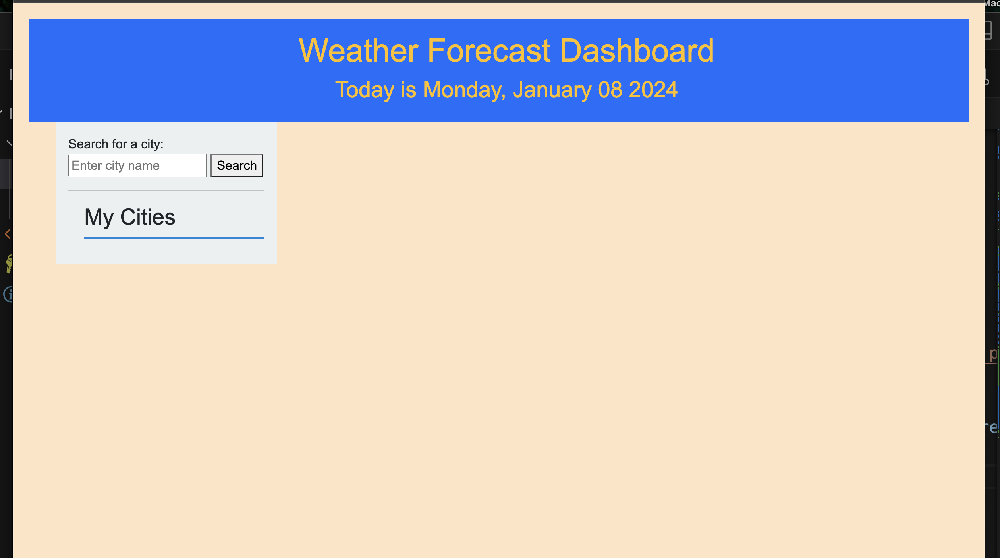
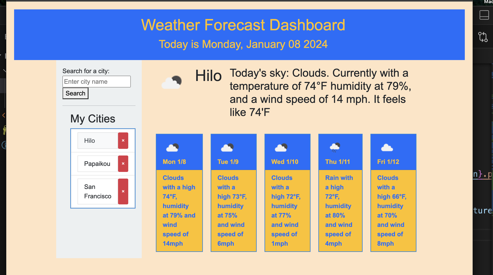

# module-6-challenge
A weather forecast dashboard

CHALLENGE GOAL:
Use the OpenWeather forecast API to create a site that shows selected city's current and future weather.

RESOURCES USED:
*Class instruction and office hours
*Pertinent MDN and W3 sections on web APIs, jquery
*Google searches
*Openweathermap API documentation
*Xpert Learning assistant

RELEVANT LINKS:
Repository: https://github.com/TreyLathe/mod-6-challenge
Deployed Site: https://treylathe.github.io/mod-6-challenge/

SCREENSHOTS:
Screen presented before search

Screen presented after searches

COMMENTS:

    GIVEN a weather dashboard with form inputs
    WHEN I search for a city
    THEN I am presented with current and future conditions for that city and that city is added to the search history

* Search bar works. When city is searched, geolocaton is found and current and future conditions are displayed.

    WHEN I view current weather conditions for that city
    THEN I am presented with the city name, the date, an icon representation of weather conditions, the temperature, the humidity, and the wind speed

* current weather conditions show city name, today's date in header, an icon that shows weather conditions, humidity, wind speed and also a 'feels like' temperature based on measured temperature, humidity and wind. 

    WHEN I view future weather conditions for that city
    THEN I am presented with a 5-day forecast that displays the date, an icon representation of weather conditions, the temperature, the wind speed, and the humidity

* 5 day forecast with date and forecast weather icon in head, weather description, high temperature, humidity and windspeed forecast.

    WHEN I click on a city in the search history
    THEN I am again presented with current and future conditions for that city

* When a city is searched, it is saved as a search item button in menu. Clicking on that button will conduct the search for the city again. The city can be simply removed from the menu. 